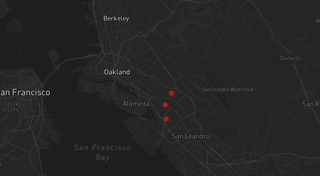

# My common places

##  Demonstration

## What is it?
["My Common places" App](seasonalchild.github.io/My-first-map/) , is a one page site that shows places where I been very much often in the summer. It works alot like google maps and has markers to click on based on where I have been commonly.

## Why I made this
When I was thinking of what I was doing during the summer, I wanted to remember common places I visited both in the summer, and sometimes on a casual day. I had decided that for fun, I could have a map to show where I have been with marker(pointers).

## Technology

To build this app, I used the following tools:

1. [Google My Maps](https://www.google.com/maps/d/u/0/), for generating the route lines, and exporting the geometries in `KML` format.
2. [Mapbox GL JS](https://docs.mapbox.com/mapbox-gl-js/guides) library, for styling and displaying maps and route lines, and adding camera behaviors (flyto animations).
3. [Visual Studio Code](https://code.visualstudio.com/download) free IDE, with [Live Server](https://marketplace.visualstudio.com/items?itemName=ritwickdey.LiveServer) and [Markdown All in One](https://marketplace.visualstudio.com/items?itemName=yzhang.markdown-all-in-one) extensions.
4. [GitHub pages](https://docs.github.com/en/pages/getting-started-with-github-pages/creating-a-github-pages-site), for publishing the app for free!

## Code Snapshot (screen shot of code)

_Quite a huge block of code for one small thing_

This block of code above lets markers appear on a map as apoint, in specific coordinates and with many properties. The main interest about it is the coordinates because you have to find a specific point in maps and input it into code. Originally, I had struggled to make my code work as it didnt show at all in the map. To debug this, I found out I had to switch the format of the coordinates because in google maps, it was reverse. I think a key takeaway is to understand the format of what you use before you input code.
